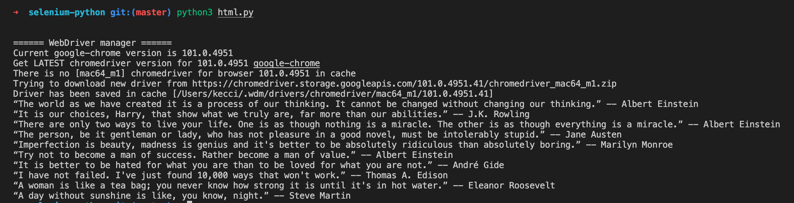

# selenium python



1. before running the application, install with this command:
```
sudo pip3 install selenium
sudo pip3 install webdriver_manager
```

2. run application:
```
python3 html.py
```

source:
- https://selenium-python.readthedocs.io/locating-elements.html